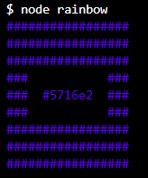
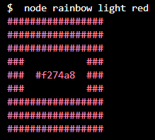

# random-color-cli (Node.js Random Color Generator)

## how to run - git clone

### clone from github:

` $ git clone https://github.com/kunstloch/random-color-cli.git `

### install:

```
$ cd random-color-cli
$ yarn 
```

### and use:

to get random hex code:

``$ node rainbow``

result look like this:




to get random color with special luminosity and hue use rainbow like this:

`` $ node rainbow light red ``


result look like this:



**luminosity** can be: bright, light or dark


**hue** can be: red, orange, yellow, green, blue, purple, pink and monochrome

## used libraries

to get random color: [randomcolor](https://www.npmjs.com/package/randomcolor)

to get colored output: [chalk](https://www.npmjs.com/package/chalk)

